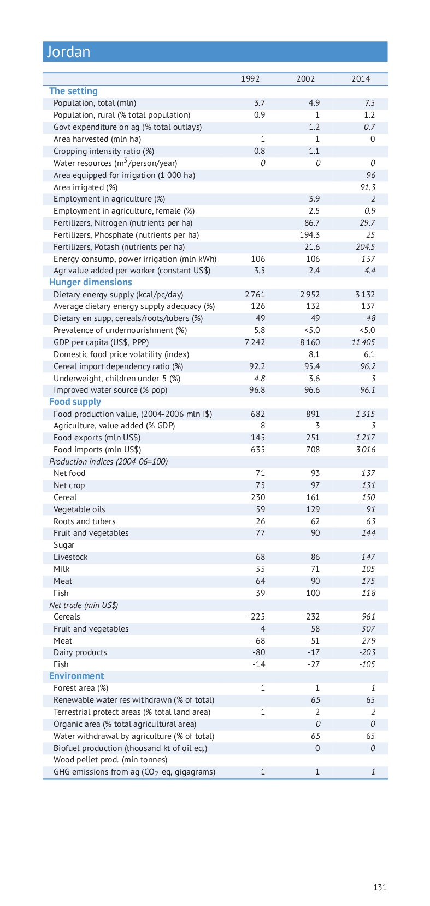
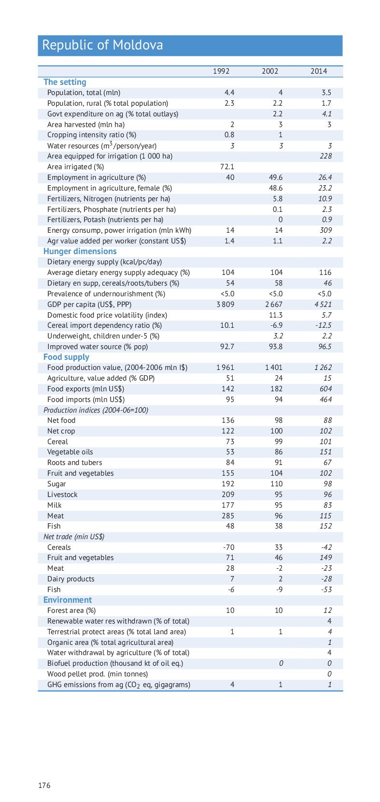

# Comment the current version of Statistical Pocket Book 2015

## Spreads

You should see the pdf on the left and a text editor on the right.

As you add new rows, please remove same number of empty rows BELOW your text not the mess the formatting below your comments!

**Select for pdf either `Page Fit` or `Page width` to match with the comments**

| Document | Comments |
| -------- | -------- |
|    | <iframe name='embed_readwrite' src='https://pad.okfn.org/p/gsyb2015_comments_tables?showControls=true&showChat=true&showLineNumbers=true&useMonospaceFont=false' width=600 height=3360></iframe> |
