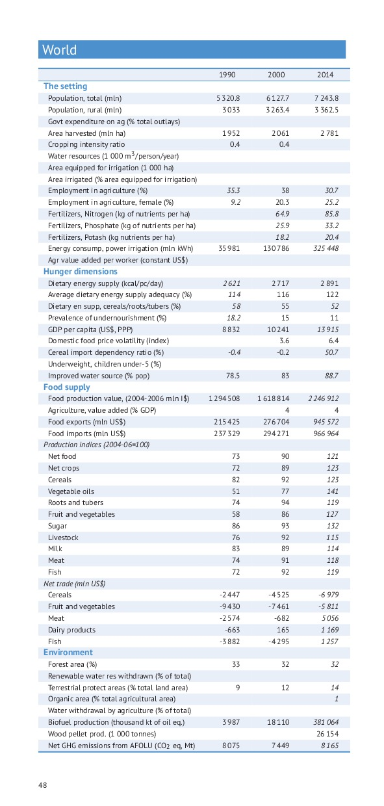
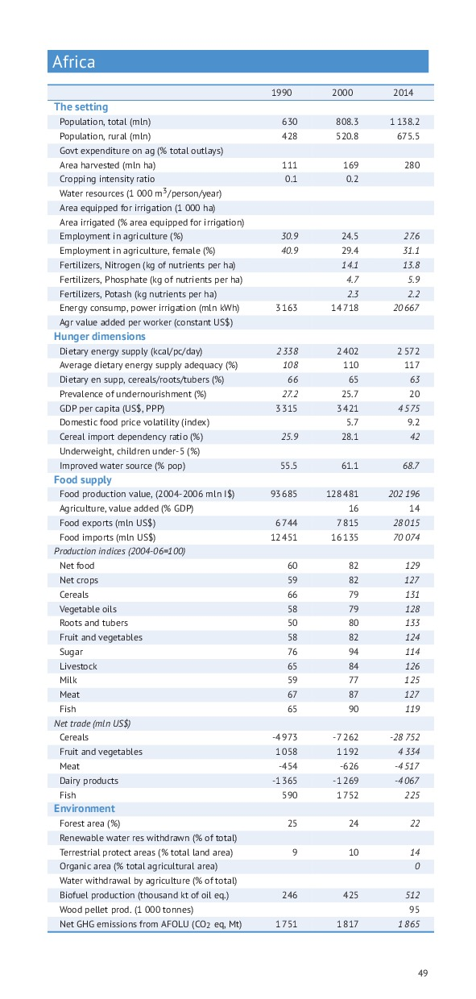
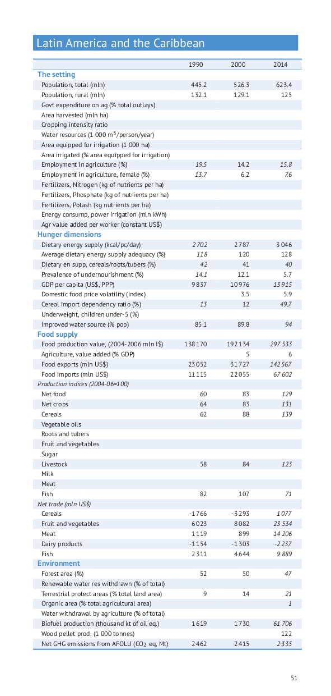

<body bgcolor="#669999">

# Comment the current version of Statistical Pocket Book 2015

## Spreads

You should see the pdf on the left and a text editor on the right.

As you add new rows, please remove same number of empty rows BELOW your text not the mess the formatting below your comments!

**Select for pdf either `Page Fit` or `Page width` to match with the comments**

| Document | Comments |
| -------- | -------- |
|                 | <iframe src="https://www.ethercalc.org/f4n6cwx7ja" width ="1200px", height="7840px"></iframe> 
 |

</body>